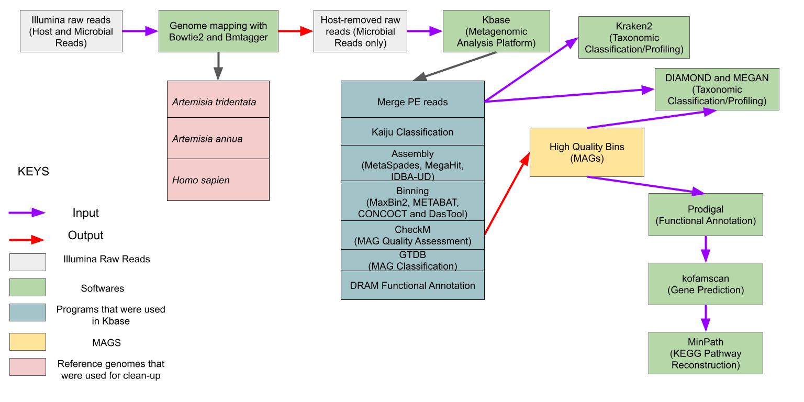
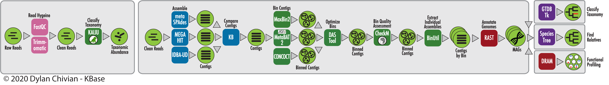
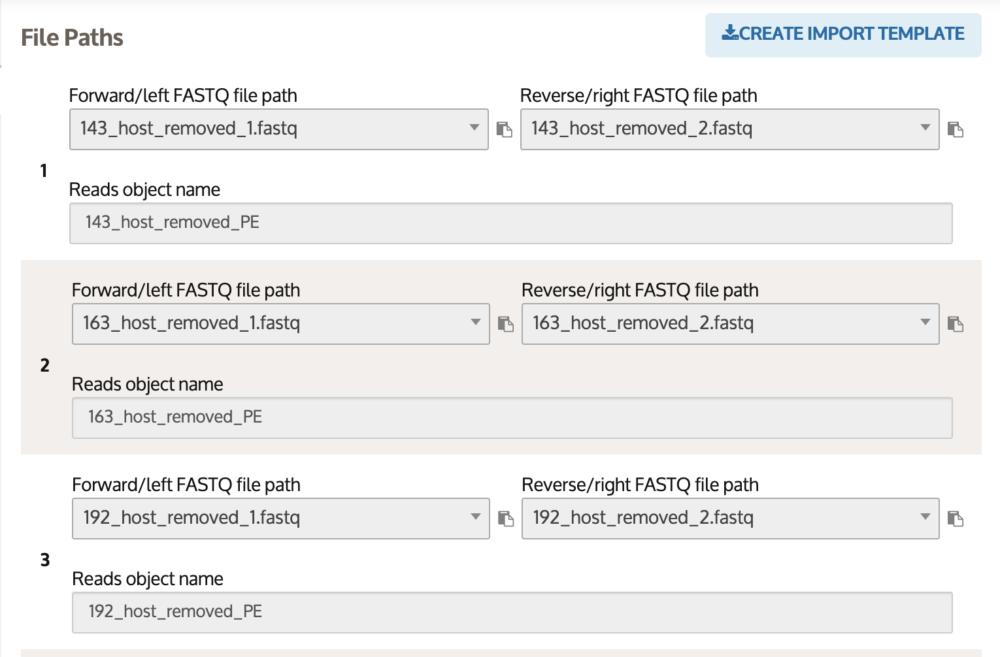
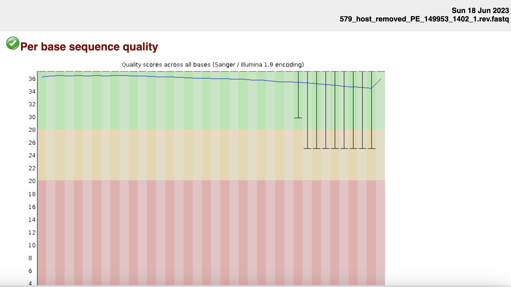
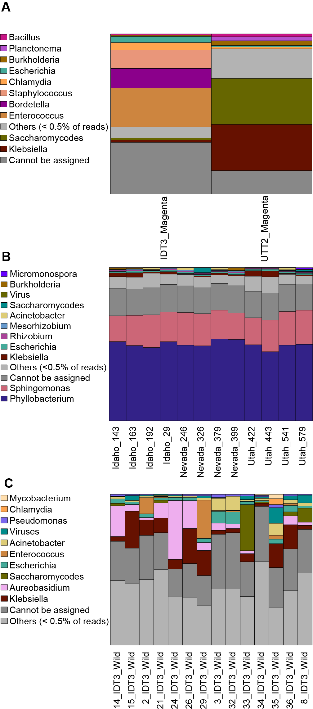
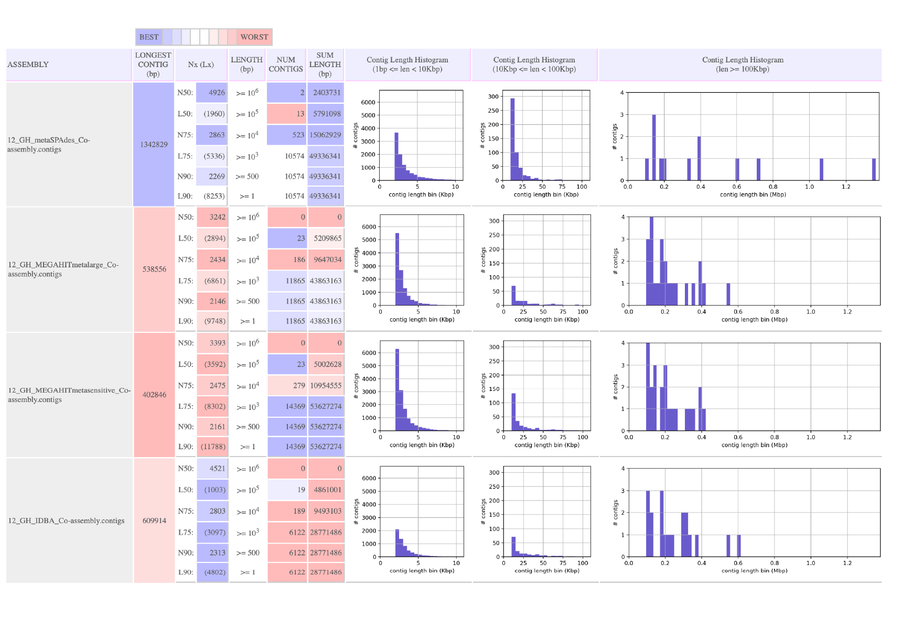

--- 
title: "Exploring sagebrush microbial metagenomes from deep, host-derived sequencing"
subtitle: "Reproducible Workflow"
author: "Adedotun Arogundade"
date: "`r Sys.Date()`"    # Instead of writing date, we use an inline code of R for it to update the code with the system's date each time you knit
output:
  bookdown::html_document2:   #We specified that we want to use the html_document2 function from bookdown to avoid any ambiguity
    toc: TRUE
 # bookdown::pdf_document2:        #### # I added hashtag at the beginning of this code because I dont have latex installed on the computer.
  #  toc: TRUE
    toc_float: yes
    toc_depth: 6
link-citations: yes   # This function is used to link your in-text citations so that when clicked it will redirect readers to the full-text references
fontsize: 12pt
bibliography: Bibliography_Sagebrush_MAGS.bib  
csl: AmJBot.csl
---


<!-- LOAD PACKAGES -->

```{r packages, echo = FALSE, warning=FALSE, include=FALSE}
###~~~
# Load R packages
###~~~
#Create vector w/ R packages
# --> If you have a new dependency, don't forget to add it in this vector
pkg <- c("knitr", "rmarkdown", "bookdown", "formattable", "kableExtra", "dplyr", "magrittr", "prettydoc", "htmltools", "knitcitations", "bibtex", "devtools")

##~~~
#2. Check if pkg are installed
##~~~
print("Check if packages are installed")
#This line outputs a list of packages that are not installed
new.pkg <- pkg[!(pkg %in% installed.packages())]

##~~~
#3. Install missing packages
##~~~
# Using an if/else statement to check whether packages have to be installed
# WARNING: If your target R package is not deposited on CRAN then need to adjust code/function
if(length(new.pkg) > 0){
  print(paste("Install missing package(s):", new.pkg, sep=' '))
  install.packages(new.pkg, dependencies = TRUE)
}else{
  print("All packages are already installed!")
}

##~~~
#4. Load all packages
##~~~
print("Load packages and return status")
#Here we use the sapply() function to require all the packages
# To know more about the function type ?sapply() in R console
sapply(pkg, require, character.only = TRUE)


## Other packages

library(data.tree)
library(DiagrammeR)


# Generate BibTex citation file for all loaded R packages
# used to produce report Notice the syntax used here to
# call the function
knitr::write_bib(.packages(), file = "packages.bib")

```


<!-- SET GLOBAL OPTIONS -->

```{r setup, include = FALSE, cache = FALSE, message = FALSE}

# Load packages
## Add any packages specific to your code
library("knitr")
library("bookdown")

# Set your working directory

setwd("~/Documents/Reproducible_Project_EEB_603")

# Chunk options: see http://yihui.name/knitr/options/ ###
## Text results
opts_chunk$set(echo = TRUE, warning = FALSE, message = FALSE, include = TRUE)
## Code decoration
opts_chunk$set(tidy = TRUE, tidy.opts = list(blank = FALSE, width.cutoff = 60),
    highlight = TRUE)
## Caching code
#opts_chunk$set(cache = 2, cache.path = "cache/")
## Plots The first dev is the master for the output
## document
opts_chunk$set(fig.path = "Figures_MS/", dev = c("png", "pdf"),
    dpi = 300)
## Locate figures as close as possible to requested
## position (=code)
opts_chunk$set(fig.pos = "H")


```


# Introduction

The purpose of this project is to develop a reproducible workflow that is specific to my research entitled **"Exploring sagebrush microbial metagenomes from deep, host-derived sequencing"**.

The objectives of this study are to profile the microbial taxa associated with big sagebrush leaves, reconstruct MAGs where possible, and explore the potential functions of the resulting MAGs. We ask the following questions:

1. Which microbial taxa can we profile from deeply sequenced sagebrush shotgun reads?

2. How does host genotype affect microbial composition and diversity?

3. Are there differences in the community composition between greenhouse-grown vs. wild plants?

## Why this study?

The traditional method for characterizing microbes is the isolation of individual strains from laboratory cultures [@Gulati_2020; @Anderson_and_Schluter_2021]. However, many microbes are difficult to culture because their natural habitat is too complex to be reproduced in the laboratory or because they rely on other species to successfully grow. This has limited the scope of microbial studies and has left many microbes uncharacterized [@Berg2020; @Bharti2019]. However, metagenomics sequencing data provides a culture-independent approach to studying complex communities of microbes [@Browne2016; @Nayfach2019]. This culture-independent approach includes taxonomic and functional profiling of microbes, as well as reconstruction of metagenome-assembled genomes (MAGs). A MAG refers to a collection of similar scaffolds that are grouped together from a metagenome assembly based on tetranucleotide frequencies (TNFs), abundances, complimentary marker genes [@Lin2016], taxonomic alignments [@Wang2019] and codon usage [@Yu2018] which represents a microbial genome.

## Why Sagebrush?

Big sagebrush (Artemisia tridentata) is an important shrub species that dominates much of the western United States' intermountain basins, shrub steppes, and deserts (USDA). The wide ecological attributes of sagebrush make it a foundational species affecting community composition, ecosystem processes, and wildlife habitat over vast portions of western North America [@Remington2021]. Its evergreen leaves offer nutrients and shade that facilitate the establishment of diverse understory plants even in arid environments. Sagebrush foliage is relatively unpalatable to livestock and other large herbivores due to high levels of terpenes and tannins, thereby buffering more palatable understory plants from intensive grazing [@Remington2021]. These grazing refuges help maintain native herbaceous diversity and allow sensitive species like perennial bunchgrasses to persist. Greater sage-grouse, pygmy rabbits, pronghorn, and mule deer rely on sagebrush for shelter and their primary winter food source [@Shipley2006]. Certain songbirds, such as Brewer's sparrow and sage thrasher, require intact sagebrush stands for nesting and rearing offspring. Sagebrush flowers are a vital nectar source for native pollinators including bees, wasps, flies, butterflies, and hummingbirds. Unfortunately, sagebrush ecosystems are critically threatened by wildfires, invasive species, climate change, land conversion, and urban development [@Miller2011] which has resulted in the loss of more than 50% of the historic sagebrush range [@Rigge2020]. The major ecological role of sagebrush underscores the need to protect the remaining intact sagebrush communities through ecological restoration and sustainable management in order to conserve biodiversity and ecosystem services across the western U.S. [@Remington2021].


# Sampling

<!---
## Sample Distribution

The map below shows the source location of the sagebrush that were sequenced for this project.

-->

## Genomic Data

We used sequence data from previous studies on sagebrush at Boise State University [@Melton2022]. These data are divided into three categories based on the environment in which the plants were grown prior to sequencing.


Category                | Sequencing Type    | Sequencing Depth | Number of Sample
------------------------|--------------------|------------------|-----------------
Magenta box             |Illumina paired-end | ~160X            | 2
Greenhouse              |Illumina paired-end | ~20X             | 12
Field/Wild              |Illumina paired-end | ~10-12X          | 14


# Bioinformatic Workflow

The workflow described here is specific to only one category of the samples (Field/Wild) that were analyzed for this project. However, the same workflow was used for all the other categories. As shown in Figure \@ref(fig:Pipeline), the bioinformatic workflow can be described in five sections 

1. [**Preprocessing**](#Preprocessing)

2. [**Taxonomic assignment of short reads**](#Taxonomic_assignment_of_short_reads)

3. [**Assembly, and binning**](#AssemblyAndBinning) 

4. [**Classification of Metagenome Assembled Genomes**](#MAG_Classification) 

5. [**Gene Prediction and Functional profiling**](#FunctionalAnnotation)


```{r Pipeline, eval= TRUE, echo=FALSE, fig.align="center", fig.cap="Overview of the bioinformatic workflow for the recovery of metagenome-assembled genomes from host-derived sequences of big sagebrush Artemisia tridentata subp. tridentata", out.width = '100%', out.height='100%'}

```

## Data structure and organisation of files

An overview of the project structure can be seen in Figure \@ref(fig:ProjectStructure). The data visualization in Figure \@ref(fig:DataTree) enhances the understanding of the data flow and code.

```{r ProjectStructure, eval= TRUE, echo=FALSE, fig.align="center", fig.cap="Overview of the project structure", out.width = '100%', out.height='100%'}
knitr::include_graphics("Images/Project_Structure.png")
```

- 01_Bowtie : This contains the .bam file that was generated from previous preliminary mapping with host genome using bowtie2.

- 02_BMTAGER: The folder that contains the output of further clean up with BMTagger

- 03_KBASE_Analysis: The folder that contains the outputs from Kbase analysis platform

- 04_Kraken: Working folder for Kraken analysis. 

- 05_DIAMOND: Working folder for DIAMOND analysis

- 06_Func_annotation: Working folder for the functional analysis


```{r DataTreeSetUp, eval = TRUE, include = FALSE, echo=FALSE, cache = FALSE, message = FALSE}

### Load R packages
library(data.tree)
library(DiagrammeR)
### Step 1: Produce a list of all files in Project_ID
filesInfo <- list.dirs(path = "Project_folder", recursive = TRUE,
    full.name = TRUE)

## Convert fileInfo into a dataframe object

filesInfo <- as.data.frame(filesInfo)

### Step 2: Convert filesInfo into data.tree class
myproj <- data.tree::as.Node(data.frame(pathString = filesInfo$filesInfo))
# Inspect output
print(myproj)

### Step 3: Prepare and plot diagram of project structure
### (it requires DiagrammeR)
# Set general parameters related to graph
data.tree::SetGraphStyle(myproj$root, rankdir = "LR")

# note that "root" is the the begining or source of the folder
# the argument rankdir = "LR" means from "left to right"

```


```{r DataTree, eval=TRUE, echo=FALSE, fig.align="center", fig.cap="Data/Project Visualization", out.width = '100%', out.height='100%'}

# Set parameters for edges
data.tree::SetEdgeStyle(myproj$root, arrowhead = "vee", color = "grey",
                        penwidth = "2px")
# Set parameters for nodes
data.tree::SetNodeStyle(myproj, style = "rounded", shape = "box")

# Plot diagram
plot(myproj)

```


## Bioinformatic Tool

Analyses presented in this report requires a UNIX-based Operating System and `ssh`, `sbatch` and `tmux` protocols should be installed. Check this [website](https://svenbuerki.github.io/Genomics-Bioinformatics/Tutorials.html) for more details and documentation on how to connect to remote computers using the `Secure Shell Protocol`. 

In addition, R and Rstudio was used to tidy/format the output of data and to produce figures. All the R analyses were performed using R version 4.2.1 (2022-06-23). The software can be downloaded [here](https://posit.co/download/rstudio-desktop/).

KBase (Web-based analyses) was accessed using Google Chrome Version 119.0.6045.105 (Official Build) (x86_64). You can install Google Chrome using this [link](https://www.google.com/chrome/)

Finally, dependencies associated to each analysis will be presented alongside the code.


## Setting Up!

```{r SettingUp, eval=FALSE}

# 1. Remotely connect to HPC computer using ssh (adjust with your credentials/IP)

ssh userID@IP

# 2. Start a dev-session 

dev-session bsu

# 3. Start tmux session and name it Sagebrush_MAGS. 

tmux new -s Sagebrush_MAGS

 # Note: Use Ctrl+b and d to safe exit a tmux session

# 3.  Navigate to project location (adjust path)

cd /path/to/Project_folder/

```


### Create a metagenomics conda environment {#InstallMetagenomicsEnv}

Create a conda environment from [Data carpentry tutorial](https://github.com/carpentries-lab/metagenomics-analysis), and name the  environment **"metagenomics"**. This environment will contain several software that will be used in this project.

```{r Metagenomic_Conda_Env, eval=FALSE}

wget https://raw.githubusercontent.com/carpentries-lab/metagenomics-analysis/gh-pages/files/spec-file-Ubuntu22.txt

#Then run to create an environment called 'metagenomics' using the yml.txt file that you donwloaded (spec-file-Ubuntu22.txt)

conda create --name metagenomics --file spec-file-Ubuntu22.txt

# Activate the metagenomics environment

conda activate metagenomics

```


## Preprocessing {#Preprocessing}

The sequences data in this study are host-derived as they were extracted from plant tissues, and with our focus on the associated microbial reads, we consider host genomes as contaminants that could impact our analyses. Therefore the need to remove them. Raw sequence data from previous projects had been initially mapped with sagebrush (Artemisia tridentata subp. tridentata) genome to generate **.bam** file which are stored in **01_Bowtie folder**. See Figure \@ref(fig:Pipeline).

### Seperate *'unmapped'* reads from *'mapped'* reads

#### Data requirement

**- Input:** `bam` files from Bowtie2

**-Output:** Unmapped non-host `fastq.gz` files.

#### Dependencies

This is done using `samtools` which can be installed using Bioconda [here](https://anaconda.org/bioconda/samtools)

```{r Install_samtools, eval=FALSE}

conda install -c bioconda samtools

```


#### Code

Here, we used a 'for loop` code that contain different code that did all the process described below.

1. We removed the host reads from the bam files

2. Then retrieved the unmapped non-host reads

3. Made it a sorted bam

4. Split the unmapped_sorted.bam file into R1 and R2

5. Finally, I deleted the unwanted intermediate "unmapped.bam" and "unmapped_sorted.bam" files.

```{r 01_Bowtie2, eval=FALSE}

# Step 1: Remove the host reads from the bam files

for F in /path/to/Project_folder/01_Bowtie/*.bam; do
	PWD=/path/to/Project_folder/
	BASENAME=${F##*/}
	SAMPLE=${BASENAME%.bam}_IDT3_NC
	OUTPUT_DIR=$PWD/01_Bowtie/Non_host_reads


# Step 2: Get the unmapped non-host reads

samtools view -b -f 12 -F 256 $F  > $OUTPUT_DIR/${SAMPLE}_unmapped.bam &&

# Step 3: Make it a sorted bam

samtools sort -n -m 5G -@ 2 $OUTPUT_DIR/${SAMPLE}_unmapped.bam -o $OUTPUT_DIR/${SAMPLE}_unmapped_sorted.bam &&

# Step 4: split the unmapped_sorted.bam file into R1 and R2

samtools fastq -@ 8 $OUTPUT_DIR/${SAMPLE}_unmapped_sorted.bam \
  -1 $OUTPUT_DIR/${SAMPLE}_host_removed_R1.fastq.gz \
  -2 $OUTPUT_DIR/${SAMPLE}_host_removed_R2.fastq.gz \
  -0 /dev/null -s /dev/null -n &&

# Step 5: Remove the intermediate "unmapped.bam" and "unmapped_sorted.bam" files

rm $OUTPUT_DIR/${SAMPLE}_unmapped.bam &&
rm $OUTPUT_DIR/${SAMPLE}_unmapped_sorted.bam

done


```


### Removal of 'host' reads using BMTagger

Downstream analysis with the "unmapped non-host" reads from Bowtie2 showed that there were still sagebrush reads in our "non-host" reads therefore, we used BMTagger, a tool specifically designed to remove the human genome from metagenomic datasets but can be adapted to remove other host genomes. See Figure \@ref(fig:Pipeline). 

In order to improve the clean-up process, we indexed reference genomes from *Artemisia tridentata*, *Artemisia annua*, and the *human hg38 genome* which were downloaded on NCBI and mapped them with our datasets.

#### Dependencies

For this, we used the one of the modules of **Metawrap** called `read_qc.sh`. We prefered this module because it does the following all at once:

1. Quality Assessment using `fastqc`.

2. Trims bad sequence data using `trim_galore`.

3. Removes host reads using `bmtagger` by mapping against the host build `.bitmask` and `.srprism` files.

Install metawrap and all of it dependencies using this code. Visit this [github](https://github.com/bxlab/metaWRAP) for more information and on how to build the 'host' BMTagger database.

```{r Metawrap_install, eval=FALSE}

conda config --add channels defaults
conda config --add channels conda-forge
conda config --add channels bioconda
conda config --add channels ursky

# Unix/Linux only
mamba create -y -n metawrap-env python=2.7

conda activate metawrap-env


```

#### Create the BMTagger folders

Set up for BMTagger clean up

```{r BMTagger_setup, eval=FALSE}

# Create a BMTAGGER folder 

mkdir /path/to/Project_folder/02_BMTAGGER 		# This is going to be my PWD

# Reference: https://github.com/bxlab/metaWRAP/blob/master/Usage_tutorial.md

# Change to the Bmtagger folder

cd /path/to/Project_folders/02_BMTAGGER

# Make a new folder called 01_RAW_READS

mkdir /path/to/Project_folder/02_BMTAGGER/01_RAW_READS

cd /path/to/Project_folder/02_BMTAGGER/01_RAW_READS

# Copy the raw non-host reads in '/path/to/Project_folder/01_Bowtie/Non_host_reads' into '/path/to/Project_folder/02_BMTAGGER/01_RAW_READS'

cp /path/to/Project_folder/01_Bowtie/Non_host_reads/* /path/to/Project_folder/02_BMTAGGER/01_RAW_READS

# Unzip the files in 01_RAW_READS (change the extension from .fastq.gz to .fastq)

cd /path/to/Project_folder/02_BMTAGGER/01_RAW_READS

gunzip *.gz

```


#### Clean with *Artemisia tridenta* subp *tridenta* genome

See Figure \@ref(fig:Pipeline).


```{r clean_with_A.tridentata, eval=FALSE}

# Create a new tmux session and change to the working directory

tmux new -s bmtagger

cd /path/to/Project_folder/02_BMTAGGER

# Activate the conda environment in this new tmux session

conda activate metawrap-env


# Run metaWRAP-Read_qc to trim the reads, remove host (A_tridentata) reads

# Make a directory for the results

mkdir /path/to/Project_folder/02_BMTAGGER/02_READ_QC


# Process all samples at the same time with a parallel for loop (especially if you have many samples)

# Note: my PWD is /path/to/Project_folder/02_BMTAGGER 

# Raw reads are found in /path/to/Project_folder/02_BMTAGGER/01_RAW_READS

for F in 01_RAW_READS/*_R1.fastq; do 
	R=${F%_*}_R2.fastq
	BASE=${F##*/}
	SAMPLE=${BASE%_host*}
	metawrap read_qc -1 $F -2 $R -t 20 -x A_tridentata -o 02_READ_QC/$SAMPLE --skip-trimming &
done	


# change to /path/to/Project_folder/02_BMTAGGER
	
cd /path/to/Project_folder/02_BMTAGGER


# move over the final QC'ed reads into a new folder but first make a new folder that will store the reads

mkdir /path/to/Project_folder/02_BMTAGGER/03_CLEAN_READS


for i in 02_READ_QC/*; do 
 b=${i#*/}
 mv ${i}/final_pure_reads_1.fastq 03_CLEAN_READS/${b}_1.fastq
 mv ${i}/final_pure_reads_2.fastq 03_CLEAN_READS/${b}_2.fastq
done


```


#### Clean with *Artemisia annua* genome

See Figure \@ref(fig:Pipeline).

The A. annua genome that was used was downloaded from NCBI under [Bioproject PRJNA416223](https://www.ncbi.nlm.nih.gov/Traces/wgs/PKPP01?display=download).

The reads in `/path/to/Project_folder/02_BMTAGGER/03_CLEAN_READS` have been cleaned of *A. tridentata* reads. Now, I want to clean them with *A. annua* reads for further clean-up due to the similarity of these genomes.

Now, these reads in `/path/to/Project_folder/02_BMTAGGER/03_CLEAN_READS` will serve as template for this new cleaning process


```{r clean_with_A.annua, eval=FALSE}

# Make a folder that will store the output

mkdir /path/to/Project_folder/02_BMTAGGER/02_READ_QC-A_annua


for F in 03_CLEAN_READS/*_1.fastq; do 
 R=${F%_*}_2.fastq
 BASE=${F##*/}
 SAMPLE=${BASE%_*}
 metawrap read_qc -1 $F -2 $R -t 5 -x A_annua -o 02_READ_QC-A_annua/$SAMPLE --skip-trimming &
done


## move over the final QC'ed reads into a new folder

mkdir /path/to/Project_folder/02_BMTAGGER/03_CLEAN_READS-A_annua


for i in 02_READ_QC-A_annua/*; do 
 b=${i#*/}
 mv ${i}/final_pure_reads_1.fastq 03_CLEAN_READS-A_annua/${b}_1.fastq
 mv ${i}/final_pure_reads_2.fastq 03_CLEAN_READS-A_annua/${b}_2.fastq
done


```


#### Clean with human (*Homo sapien*) genome

See Figure \@ref(fig:Pipeline).

The reads in `/path/to/Project_folder/02_BMTAGGER/03_CLEAN_READS-A_annuaS` have been cleaned of *A. tridentata* and *A. annua* reads. Now, I want to clean them with *Homo sapien* genome to remove any potential contaminants that may get carried forward from the DNA extraction process.

The human genome that was used was downloaded from https://hgdownload.soe.ucsc.edu/goldenPath/hg38/chromosomes/ using `wget` and `ftp` protocol: `wget ftp://hgdownload.soe.ucsc.edu/goldenPath/hg38/chromosomes/*fa.gz`. Check this [link](https://github.com/bxlab/metaWRAP/blob/master/installation/database_installation.md) for details.

Now, these reads in `/path/to/Project_folder/02_BMTAGGER/03_CLEAN_READS-A_annua` will serve as template for this new cleaning process


```{r clean_with_human_genome, eval=FALSE}

# Make a folder that will store the output

mkdir /path/to/Project_folder/02_BMTAGGER/02_READ_QC-human


for F in 03_CLEAN_READS-A_annua/*_1.fastq; do 
 R=${F%_*}_2.fastq
 BASE=${F##*/}
 SAMPLE=${BASE%_*}
 metawrap read_qc -1 $F -2 $R -t 5 -x hg38 -o 02_READ_QC-human/$SAMPLE --skip-trimming &
done


## move over the final QC'ed reads into a new folder

mkdir /path/to/Project_folder/02_BMTAGGER/03_CLEAN_READS-human


for i in 02_READ_QC-human/*; do 
 b=${i#*/}_host_removed
 mv ${i}/final_pure_reads_1.fastq 03_CLEAN_READS-human/${b}_1.fastq
 mv ${i}/final_pure_reads_2.fastq 03_CLEAN_READS-human/${b}_2.fastq
done


# Note that I added the phrase "host_removed" to the final cleaned read

```


#### Output

Table \@ref(tab:CleanReads) shows the result of the cleaning process


```{r CleanReads, echo=FALSE}

#loads the packages 'knitr' and 'dplyr'
library(knitr)
library(dplyr)


#call in the data frame and name the object Host.removed

Cleaned.Host.reads <- read.csv("./Data/Cleaned_Host_Reads.csv")


# Plot table and add caption

knitr::kable(Cleaned.Host.reads, caption = "Approximate size of ‘host’ cleaned reads that were removed from the sequencing data.", align = "c") %>%
  pack_rows(index = c("Magenta Samples" = 2, "Greenhouse Samples" = 12, "Field/Wild Samples" = 14)) %>%
    kable_paper("hover", full_width = F, html_font = "Cambria")


```


## Taxonomic assignment of short reads {#Taxonomic_assignment_of_short_reads}

As shown in Figure \@ref(fig:Pipeline), the Department of Energy Systems Biology Knowledgebase (KBase) System was used for our downstream metagenomic analyses [@Arkin2018] with default parameters for all software unless otherwise stated. You can sign up to Kbase using this [link](https://www.kbase.us/). 

Figure \@ref(fig:KbaseOverview) below shows the Kbase pipeline that was used in this study. You can watch the short video below on how to get started on Kbase [here](https://www.youtube.com/watch?v=WKKKXg55hs0)

```{r KbaseOverview, eval=TRUE, echo=FALSE, fig.align="center", fig.cap="Overview of Kbase Pipeline", out.width = '100%', out.height='100%'}




```


### Import into Kbase

Start by importing the sets of paired-end reads in FASTQ format as described in Figure \@ref(fig:KbaseImport). The Import App creates a PairedEndLibrary object that we can then run through FastQC to further check the quality of the reads.

```{r KbaseImport, eval=TRUE, echo=FALSE, fig.align="center", fig.cap="Screenshot on how to Import Data into Kbase", out.width = '100%', out.height='100%'}




```


### Run FastQC

#### Data Requirement

- **Input**: PairedEndLibrary that was generated using the Import Application

- **Output**: Quality Report in HTML format.

#### Dependencies

We used `Assess Read Quality with FastQC - v0.12.1` for further check the quality of our data. An example of the result can be is on Figure \@ref(fig:KbaseFastQC)

```{r KbaseFastQC, eval=TRUE, echo=FALSE, fig.align="center", fig.cap="Screenshot of a FastQC report for one of the samples", out.width = '100%', out.height='100%'}




```


### Taxonomic Assignment of short reads with Kaiju

#### Data Requirement

- **Input**: PairedEndLibrary that was generated using the Import Application

- **Output**: Taxonomic visualization plots. It also produces a taxonomic report that can be exported into other programs to generate better quality plots.

#### Dependencies

We used `Classify Taxonomy of Metagenomic Reads with Kaiju - v1.9.0` on Kbase to classify the short Illumina reads. The software was configured as follows

```{r Kaiju, eval=FALSE}

Taxonomic Level           = ALL

Reference DB              = NCBI BLAST nr + euk
  
Low Abundance Filter      = 0.5

Subsample percent         = 100

```

The outputs of Kaiju were exported out of Kbase and used to plot bar graph. Figure \@ref(fig:KbaseFastQC) is a barplot generated using the outputs from KBase.

```{r TaxaPlot, eval=TRUE, echo=FALSE, fig.align="center", fig.cap="Taxonomic barplot showing the relative abundance of the top taxa across A) Magenta samples B) Greenhouse samples C) Wild/Field Samples at the genus level.", out.width = '100%', out.height='100%'}




```

### Taxonomic Assignment of short reads with Kraken2 and DIAMOND

We also used other classification tool such as  Kraken2 and DIAMOND/MEGAN [@Wood2019; @Buchfink2015] so that we can compare the results of Kaiju with other softwares. We found that the results are very similar. In order to keep this project concise, we will not explain the details of these software.


## Assembly, and binning {#AssemblyAndBinning}

### Assembly

#### Data Requirement

- **Input**: PairedEndLibrary that was generated using the Import Application or Merged Read library if you have multiple samples.

- **Output**: Output ContigSet.

#### Dependencies

We built co-assemblies of sequence data from plants in the same category; i.e., microbial sequences from all greenhouse-grown plants were co-assembled and those from all the field-grown were co-assembled. 

KBase provides three assembly tools: `MetaSPAdes v3.15.3` [@Nurk2017], `MEGAHIT v1.2.9` [@Li2015], and `IDBA-UD v1.1.3` [@Peng2012], and we used all three of these programs to assemble the metagenomic reads into contiguous sequences. See figure \@ref(fig:KbaseOverview)

Assembling with multiple different tools is a common way to find which one produces the best results. Using `Compare Assembled Contig Distributions v1.1.2` software on Kbase, we saw that metaSPAdes has the best N50, N75, and it produced the longest contigs. See Figure \@ref(fig:KbaseOverview)


```{r KbaseCompareContigs, eval=TRUE, echo=FALSE, fig.align="center", fig.cap="Result of Contig Comparison", out.width = '100%', out.height='100%'}




```


### Binning

#### Data Requirement

- **Input**: PairedEndLibrary that was generated using the Import Application.

- **Output**: BinnedContig in `.fasta` format.

#### Dependencies

Just like with the assembly process, we used three binning programs: `MaxBin2 v2.2.4` [@Wu2016], `MetaBAT2 v1.7` [@Kang2019], and `CONCOCT v1.1` [@Alneberg2014] for MAG reconstruction. The individual outputs (bins) from these programs were passed into `DASTools- v1.1.2` to produce high-quality non-redundant MAGs. See figure \@ref(fig:KbaseOverview).

  
## Classification of Metagenome Assembled Genomes {#MAG_Classification}

#### Data Requirement

- **Input**: BinnedContig in `.fasta` format

- **Output**: CheckM quality table in `.csv` format. Classification plot generated with SpeciesTree.

#### Dependencies

Prior to classification, `CheckM v1.0.18` was used to assess the quality of the MAGs and then removed the `Bin.003` with **>10% contamination**. See table \@ref(tab:KbaseCheckM) 


```{r KbaseCheckM, echo=FALSE}

#loads the packages 'knitr' and 'dplyr'
library(knitr)
library(dplyr)


#call in the data frame and name the object Host.removed

CheckM_Table <- read.csv("./Data/CheckM_Assessment.csv")


# Plot table and add caption

knitr::kable(CheckM_Table, caption = "CheckM quality assessment of metagenome-assembled genomes that were recovered from greenhouse plants.", align = "c") %>%
  row_spec(3, background = "firebrick") %>%
    kable_paper("hover", full_width = F, html_font = "Cambria") %>%
    add_footnote("The red highlighted area shows the low-quality bin that was filtered with the set parameter of >50% completion and <10% contamination")


```


Genome Taxonomy Database tool kit, `GTDB-Tk v1.7.0` [@Chaumeil2019] was used to classify the other two bins.. See figure \@ref(fig:KbaseGTDB)

```{r KbaseGTDB, eval=TRUE, echo=FALSE, fig.align="center", fig.cap="Classification Tree generated by SpeciesTree - v2.2.0 on KBase", out.width = '100%', out.height='100%'}


knitr::include_graphics("Images/Methagenome_Assembled_Genomes_from_GreenHouse_Plants.png")

```

In addition to GTDB classification, we exported the fasta files of these bins from Kbase and classified them using Kraken2 and DIAMOND. We found that the Kraken2 and DIAMOND results were consistent with the GDTB-generated taxonomy but we will not go into the details of these software.


## Gene Prediction and Functional profiling {#FunctionalAnnotation}

Gene prediction helps to predict the genetic potential of the recovered metagenome-assembled genomes.

### DRAM Annotation on KBase.

We used the `Annotate and Distill Assemblies with DRAM` software on KBase and the output can be seen in Figure \@ref(fig:KbaseDRAM)

```{r KbaseDRAM, eval=TRUE, echo=FALSE, fig.align="center", fig.cap="DRAM Annotation of MAGS", out.width = '100%', out.height='100%'}


knitr::include_graphics("Images/Kbase.DRAM.Annotation.png")

```


### Gene Prediction

We also annotated the MAGS using `Prodigal` [@Hyatt2010], the annotated genomes were then passed into `KofamScan` (https://github.com/takaram/kofam_scan), a command line interface of the web-based `KofamKOALA` [@Aramaki2019], a gene function annotation tool based on KEGG Orthology and hidden Markov model. `MinPath` [@Ye2009] was used to reconstruct a parsimonious Kyoto Encyclopedia of Genes and Genomes, KEGG [@Kanehisa2000] biological pathway using protein family predictions, this provides comprehensive reports on the metabolic modules and pathways that are found in MAGs.

#### Prodigal

##### Data Requirement

- **Input**: Genomes of the recovered bins in FASTA format. It can either be in `.fa` or `.fasta`.

- **Output**: `.fna`, `.ggf` and `.protein.faa` files. The protein file `.protein.faa` will be used as input for KOFAM Scan

##### Dependencies

If installed the `metagenomics` environment described in this [section](#InstallMetagenomicsEnv), just go ahead and activate the environment.

```{r, eval=FALSE}

conda activate metagenomics

```


If you did not install that environment and you don't want to, you can install prodigal directly.

```{r, eval=FALSE}

conda install -c bioconda prodigal

```


##### Code

```{r ProdigalCode, eval=FALSE}


# Start a new tmux session

tmux new -s Functional.Annotation

# Activate the environment

conda activate metagenomics


# Make a new folder for the functional annotation

mkdir /path/to/Project_folder/06_Func_annotation

cd /path/to/Project_folder/06_Func_annotation


# Make a folder to store the FASTA files

mkdir /path/to/Project_folder/06_Func_annotation/01_bins.fasta

# Download the bins from KBase and move them into /path/to/Project_folder/06_Func_annotation/01_bins.fasta using FileZilla


# Run Prodigal on the bins 
# Run the program in normal mode. See https://github.com/hyattpd/prodigal/wiki/Advice-by-Input-Type#draft-genomes for more details.


# Create a for loop that runs the analysis for all of the bins  


for F in /path/to/Project_folder/06_Func_annotation/01_bins.fasta/*.fa; do
SAMPLE_NAME=$(basename "${F}" .fa)

mkdir /path/to/Project_folder/06_Func_annotation/${SAMPLE_NAME}_output

OUTPUT_DIR=/path/to/Project_folder/06_Func_annotation/${SAMPLE_NAME}_output

prodigal -a $OUTPUT_DIR/${SAMPLE_NAME}.protein.faa -d $OUTPUT_DIR/${SAMPLE_NAME}.contigs.fna -i $F  -o $OUTPUT_DIR/${SAMPLE_NAME}.gff

done


```


#### KOFAM Scan

##### Data Requirement

- **Input**: Protein file `.faa` from Prodigal

- **Output**: KEGG Mapper file in `.txt`.

##### Dependencies

```{r InstallKOFAMScan, eval=FALSE}

## Run KOFAM

#Ref: https://taylorreiter.github.io/2019-05-11-kofamscan/

# Make a directory at /path/to/Project_folder/06_Func_annotation

mkdir /path/to/Project_folder/06_Func_annotation/02_KOFAM_Scan

cd /path/to/Project_folder/06_Func_annotation/02_KOFAM_Scan

wget ftp://ftp.genome.jp/pub/db/kofam/ko_list.gz		# download the ko list 
wget ftp://ftp.genome.jp/pub/db/kofam/profiles.tar.gz 		# download the hmm profiles
wget ftp://ftp.genome.jp/pub/tools/kofam_scan/kofam_scan-1.3.0.tar.gz # download kofamscan tool
wget ftp://ftp.genome.jp/pub/tools/kofamscan/README.md		# download README


# unzip and untar the relevant files:

gunzip ko_list.gz

tar xf profiles.tar.gz

tar xf kofam_scan-1.3.0.tar.gz

## Make a directory that will store the outputs

mkdir /path/to/Project_folder/06_Func_annotation/02_KOFAM_Scan/01_output

# Make a conda environment using miniconda

mamba create -n kofamscan

# activate the environment

mamba activate kofamscan

# Now, install ruby into the new environment

mamba install -c conda-forge ruby

# Also install kofamscan hmmer and parallel

mamba install kofamscan hmmer parallel


#make a config.yml file that has the directories, paste below and update with your own directories

vim config.yml

####PASTE BELOW INTO NEW YML AND UPDATE WITH NEW PATHS
# Path to your KO-HMM database
# A database can be a .hmm file, a .hal file or a directory in which
# .hmm files are. Omit the extension if it is .hal or .hmm file
profile: /path/to/Project_folder/06_Func_annotation/02_KOFAM_Scan/profiles

# Path to the KO list file
ko_list: /path/to/Project_folder/06_Func_annotation/02_KOFAM_Scan/ko_list

# Path to an executable file of hmmsearch
# You do not have to set this if it is in your $PATH
hmmsearch: ~/miniconda3/envs/kofamscan/bin/hmmsearch

# Path to an executable file of GNU parallel
# You do not have to set this if it is in your $PATH
parallel: ~/miniconda3/envs/kofamscan/bin/parallel

# Number of hmmsearch processes to be run parallelly
cpu: 48
####


```


##### Code

```{r KOFAMScanCode, eval=FALSE}

# Use a for loop

for F in /path/to/Project_folder/06_Func_annotation/*Bin*/*.faa; do

SAMPLE_NAME=$(basename "${F}" .faa)

OUTPUT_DIR=/path/to/Project_folder/06_Func_annotation/02_KOFAM_Scan/01_output

~/miniconda3/pkgs/kofamscan-1.3.0-hdfd78af_2/bin/exec_annotation -c /path/to/Project_folder/06_Func_annotation/02_KOFAM_Scan/config.yml $F -o $OUTPUT_DIR/${SAMPLE_NAME}.txt

done


```


#### MinPath

##### Data Requirement

- **Input**: KEGG Mapper file from KofamScan

- **Output**: KEGG Output file with annotated genes.

##### Dependencies

```{r, eval=FALSE}

# Change to the folder

cd /path/to/Project_folder/06_Func_annotation

# Make a new folder for the MinPath annotation

mkdir 04_MinPath

cd 04_MinPath


## Copy the git repository that contain Minpath executable (https://github.com/mgtools/MinPath)

git clone https://github.com/mgtools/MinPath


# Use the information on this webpage to install glpk (https://github.com/mgtools/MinPath/blob/master/glpk-4.6/INSTALL)

# Move into the glpk folder

cd /path/to/Project_folder/06_Func_annotation/04_MinPath/MinPath/glpk-4.6

# Configuring the package

./configure


# Compile the package

make

# Check the package

make check

# Install the package. Note: By default, 'make install' will install the package's files in
'usr/local/bin', 'usr/local/lib'. So, specify an installation
prefix other than '/usr/local'

make prefix=~/miniconda3/bin install

### make sure that you can call command glpsol under glpk-4.6/examples

/path/to/Project_folder/06_Func_annotation/04_MinPath/MinPath/glpk-4.6/examples

./glpsol -h


```


##### Code

```{r MinPath, eval=FALSE}

## Now run the analysis
# Ref: https://github.com/mgtools/MinPath/blob/master/readme

# Make a folder for the input and output files

mkdir /path/to/Project_folder/06_Func_annotation/04_MinPath/01_input

mkdir /path/to/Project_folder/06_Func_annotation/04_MinPath/02_output


# Copy the .txt files in "/path/to/Project_folder/06_Func_annotation/02_KOFAM_Scan/01_output" into "/path/to/Project_folder/06_Func_annotation/04_MinPath/01_input"


cp /path/to/Project_folder/06_Func_annotation/02_KOFAM_Scan/01_output/*txt /path/to/Project_folder/06_Func_annotation/04_MinPath/01_input

# Change to /path/to/Project_folder/06_Func_annotation/04_MinPath/01_input


cd /path/to/Project_folder/06_Func_annotation/04_MinPath/01_input

```


Format the KEGG Mapper files into a format that can be used by the MinPath program

```{r, eval=FALSE}

for F in /path/to/Project_folder/06_Func_annotation/04_MinPath/01_input/*.txt; do

SAMPLE_NAME=$(basename "${F}" .txt)

OUTPUT_DIR=/path/to/Project_folder/06_Func_annotation/04_MinPath/01_input

##### convert this output to a form that can be used with KEGG decoder

awk '{print $1, $2}' $F > $OUTPUT_DIR/${SAMPLE_NAME}.mapper.txt


# Delete the first two rows of the data using tail command

tail -n +3 $OUTPUT_DIR/${SAMPLE_NAME}.mapper.txt > $OUTPUT_DIR/${SAMPLE_NAME}.mapper2.txt

# There are some rows that contains asterisks "* " in the first column, I will delete these strings but the rows using the awk command

awk '$1 != "*" { print }' $OUTPUT_DIR/${SAMPLE_NAME}.mapper2.txt > $OUTPUT_DIR/${SAMPLE_NAME}.mapper3.txt


## Turn the file into a tab-separated file

# Use sed or awk

sed 's/ /\t/g' $OUTPUT_DIR/${SAMPLE_NAME}.mapper3.txt > $OUTPUT_DIR/${SAMPLE_NAME}.mapper4.txt


awk 'BEGIN {FS=" "; OFS="\t"} {$1=$1}1' $OUTPUT_DIR/${SAMPLE_NAME}.mapper3.txt > $OUTPUT_DIR/${SAMPLE_NAME}.mapper4.txt


# In the second column, replace the rows that contains hypen "-" with nothing "" but do not delete the rows

awk '{sub(/-/, "", $2)}1' $OUTPUT_DIR/${SAMPLE_NAME}.mapper4.txt > $OUTPUT_DIR/${SAMPLE_NAME}.mapper5.txt

done


```

Alternatively, you can make the code more concise by using the pipe (|) function for the codes above.


```{r, eval=FALSE}

for F in /path/to/Project_folder/06_Func_annotation/04_MinPath/01_input/*.txt; do

SAMPLE_NAME=$(basename "${F}" .txt)

OUTPUT_DIR=/path/to/Project_folder/06_Func_annotation/04_MinPath/01_input

awk '{print $1, $2}' $F | tail -n +3 | awk '$1 != "*" { print }' | awk 'BEGIN {FS=" "; OFS="\t"} {$1=$1}1' | awk '{sub(/-/, "", $2)}1' > $OUTPUT_DIR/${SAMPLE_NAME}.mapperfile.txt

done


```


Now that the Mapper files have been formated appropriately, let's run the program. Check this [link](https://github.com/mgtools/MinPath/blob/master/readme) for more details.

```{r, eval=FALSE}

for F in /path/to/Project_folder/06_Func_annotation/04_MinPath/01_input/*.mapperfile.txt; do

SAMPLE_NAME=$(basename "${F}" .txt)

OUTPUT_DIR=/path/to/Project_folder/06_Func_annotation/04_MinPath/02_output

python /path/to/Project_folder/06_Func_annotation/04_MinPath/MinPath/MinPath.py \
	-ko $F \
	-report $OUTPUT_DIR/${SAMPLE_NAME}.minpath \
	-details $OUTPUT_DIR/${SAMPLE_NAME}.minpath.details

done


```

You will get a KEGG Output file with annotated genes that you can import into other programs.

# References

<div id="refs"></div>

<!-- We included this code so that we tell the computer to create another environment after our references. This is important because markdown is designed to have references at the end of the text-->


# (APPENDIX) Appendices {-}

<!-- This code "(APPENDIX) Appendices {-}" was included so that Appendix will not be included as part of the table of content.  -->

# Appendix 1

Citations of all R packages used to generate this report.

```{r r generateBibliography, results = "asis", echo = FALSE, warning = FALSE, message = FALSE}
### Load R package
library("knitcitations")
### Process and print citations in packages.bib Clear all
### bibliography that could be in the cash
cleanbib()  # this code cleans the cache of the bib so that we do not get errors.

# Set pandoc as the default output option for bib
options(citation_format = "pandoc")
# Read and print bib from file
read.bibtex(file = "packages.bib")


```


# Appendix 2

Version information about R, the operating system (OS) and attached or R loaded packages. This appendix was generated using `sessionInfo()`.

```{r, echo=FALSE}

# Load and provide all packages and versions
sessionInfo()


```


